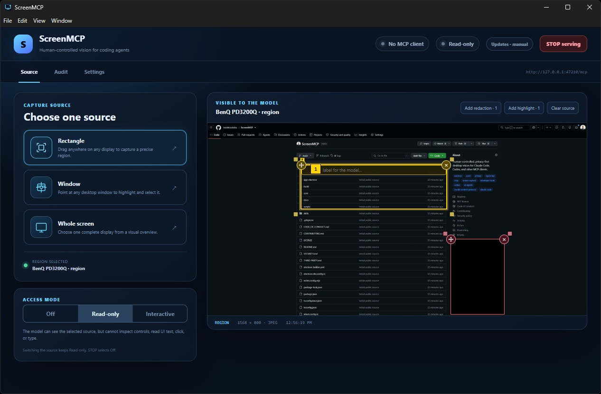
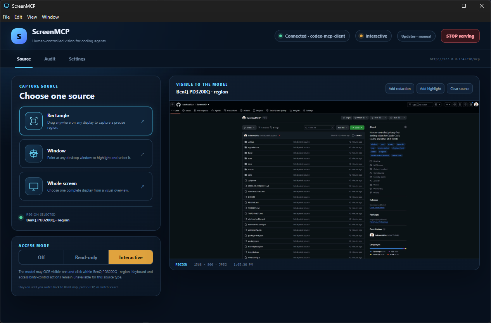
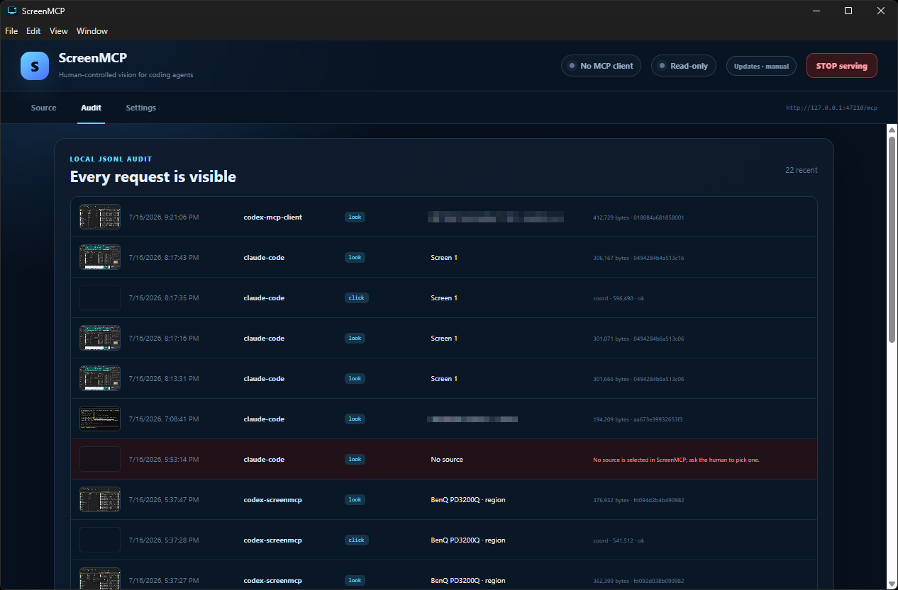
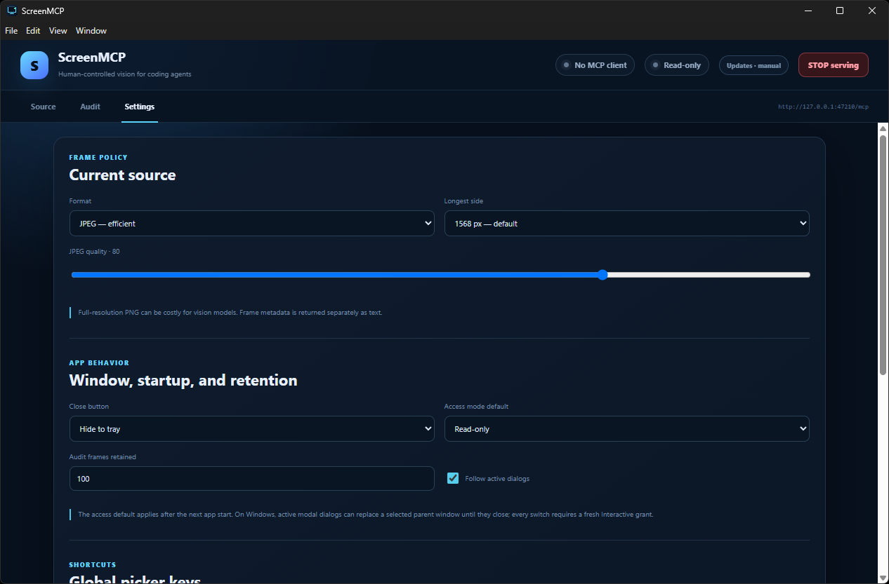

# ScreenMCP

Human-controlled desktop vision for Claude Code, Codex, and other MCP clients.

[](https://github.com/ludekvodicka/ScreenMCP/actions/workflows/ci.yml)
[](https://github.com/ludekvodicka/ScreenMCP/releases/latest)
[](LICENSE)



ScreenMCP is a local Electron app. The human chooses one monitor, window, or region; coding agents can see it — and, in Interactive mode, click and type within it — through an authenticated MCP endpoint, and nothing else. Off, Read-only, and Interactive access modes, an emergency STOP control, per-source redaction masks, change-aware capture, and a local audit trail keep the human in control at every step.

## What ScreenMCP can do

### One source, chosen by a human

You pick exactly one **monitor, window, or region** — a dragged Rectangle, a point-and-highlight Window, or a Whole-screen chooser. Nothing is shared until you choose, and the selected source stays open as a persistent stream, so no OS picker pops up for every model request. `describe_source` reports the source kind, label, and dimensions without capturing an image.

### See only what you allow — redaction and highlights

Draw **redaction masks** to black out secrets and **highlights** to point the model at what matters, right on top of the selected source. Masks are applied before resize, hashing, encoding, MCP resources, and any retained audit frame — the model never receives the hidden pixels, and a highlight can carry a short label written just for the model. The image at the top of this page is exactly what the model would receive for that region.

### Three access modes — including writeable actions

One toggle moves between **Off**, **Read-only**, and **Interactive**:

- **Off** — the global STOP gate. MCP clients stay connected, but every screen and control call returns `capture_stopped`.
- **Read-only** — the model sees the selected source through `look` and `wait_for_change`, but cannot inspect controls, read UI text, click, or type.
- **Interactive** *(Windows)* — the model can act on the source: `list_elements` (UI Automation control tree), `read_text` (UIA value or OCR of a region), `click` (UIA invoke or a scoped coordinate click), and `type_text` (UIA value or scoped keystrokes). A window source unlocks the full accessibility tree; a monitor or region source allows OCR and coordinate clicks.

Interactive is bound to the current source, shown in amber, and revoked the moment you change source, press STOP, or go Off — there is no focus or idle auto-revoke, so it stays on while you work in other apps until you turn it off.



A `click` or `type_text` that arrives while you are in **Read-only** does not silently fail: ScreenMCP surfaces its window and waits up to 120 seconds for your explicit approval before switching to Interactive and continuing the same call. Denial, timeout, or a source change produces no input.

### Change-aware capture

`look(changed_since)` returns a text-only `changed:false` when the frame's perceptual hash is within a configurable threshold, and `wait_for_change` long-polls up to 120 seconds and returns a frame only after a meaningful visual change — so watching an app for progress does not burn vision tokens on an idle screen.

### Every request is on the record

A **local JSONL audit trail** records every request — client name, source, action, byte size, and outcome — alongside post-redaction thumbnails you can review in the app. Typed content is never stored; the target is logged as `[redacted N chars]`.



### Tuned to your machine

Frame format and longest side, JPEG quality, close-to-tray behavior, the startup access default, audit-frame retention, active-dialog following, and the global picker shortcuts are all configurable.



## Downloads

Release binaries are currently unsigned. Verify the matching entry in `SHA256SUMS.txt` before running a
download from [GitHub Releases](https://github.com/ludekvodicka/ScreenMCP/releases/latest).

| Platform | Package | Update behavior |
| --- | --- | --- |
| Windows | `ScreenMCP-Setup-…exe` | Checks GitHub Releases; download and restart require approval. |
| Windows | `ScreenMCP-Portable-…exe` | Manual replacement from Releases. |
| macOS | `ScreenMCP-…dmg` | Manual while builds remain unsigned and unnotarized. |
| Linux | `ScreenMCP-…AppImage` / `.deb` | Packaged builds check GitHub Releases; download and restart require approval. |

Windows SmartScreen and macOS Gatekeeper can warn because there is no signing certificate yet.

## Run from source

Requirements: Node.js 24 and npm 11.

```sh
npm ci
npm run dev
```

For a production directory build:

```sh
npm run package:dir
```

Tagged releases build NSIS and portable Windows packages, an unsigned macOS DMG, and Linux AppImage and deb packages.
Manual release-workflow runs build the same three-OS artifacts without creating a tag or Release.

## Connect an agent

On startup ScreenMCP detects installed Claude Code and Codex clients and installs the matching
`screenmcp` skill automatically. Windows uses a junction; macOS and Linux use a directory symlink.
The links point to a content-addressed copy under `~/.screenmcp/skill-payloads`, so they survive app
updates and portable/AppImage paths. Existing real directories and foreign links are never replaced.

Start ScreenMCP, select a source, then register the MCP endpoint once. The installed skill contains a
target-specific `register.mjs` beside its `SKILL.md`; the source-repository equivalents are:

Claude Code:

```sh
node skills/shared/register.mjs claude
```

Codex:

```sh
node skills/shared/register.mjs codex
```

The helper reads `~/.screenmcp/endpoint.json`; no token copy/paste is needed. A binary release also
attaches the standalone shared `register.mjs`. Restart or reconnect the agent if its MCP tool list was
already initialized. See [agent skill installation](docs/architecture/agent-skill-installation.md)
for target paths, update behavior, and conflict handling.

On first connection, ScreenMCP shows the client-reported name and version. Choose allow once, always allow, or deny.

## MCP surface

| Name | Behavior |
| --- | --- |
| `look` | Returns the selected frame and JSON metadata. With `changed_since`, returns text-only `changed:false` when the dHash is within the configured threshold. |
| `describe_source` | Returns source kind, label, dimensions, mask count, and frame policy without capturing an image. |
| `wait_for_change` | Long-polls for up to 120 seconds and returns one frame only after a meaningful visual change. |
| `list_elements` | Lists accessible controls of the interaction-enabled window with opaque refs and payload-pixel bounds. |
| `read_text` | Reads an allowed UIA element or OCRs a redacted payload-pixel region. |
| `click` | Invokes an allowed UIA element or clicks a scoped payload-pixel point; from Read-only it may wait for a human mode decision. |
| `type_text` | Replaces an allowed field value or sends scoped keystrokes; from Read-only it may wait for a human mode decision. |
| `screen://current` | Reads a forced current frame through the same crop, mask, resize, and encoding pipeline. |

Agents should retain the returned hash, prefer `wait_for_change` for watching an app, and stop calling immediately when ScreenMCP reports `capture_stopped` or `no_source`. `capture_stopped` means access is Off; the human must switch to Read-only or Interactive before another screen call. Ready-made instructions live in [the Claude skill](skills/claude/screenmcp/SKILL.md) and [the Codex skill](skills/codex/screenmcp/SKILL.md).

## Privacy model

- The server binds only to `127.0.0.1` and requires a random 48-character bearer token.
- `endpoint.json` and settings are written atomically under `~/.screenmcp`; files use mode `0600` where the OS supports POSIX modes.
- Browser-origin requests are rejected to reduce DNS-rebinding and drive-by localhost attacks.
- Raw captured pixels stay in memory. Only post-redaction audit JPEGs capped at 960×600 are written to disk, with configurable retention and a local viewer.
- Off and STOP share one global gate that blocks every screen and control operation while MCP clients may remain connected. Clearing the source closes its stream.
- Startup defaults to Read-only unless the human chooses Off in Settings. Interactive is explicit, bound to the current source, shown in amber, and revoked on source change, Off/STOP, or quit; blur and idle do not revoke it.
- On Windows, a selected parent can switch its one stream to a same-process active modal and back. This is configurable in Settings; each switch revokes Interactive and uses separate dialog masks/highlights.
- Interactive requests and audit rows use the MCP client's self-reported name as a label, not cryptographic identity; typed content is never shown in the request.

See [privacy model](docs/architecture/privacy-model.md) and [capture pipeline](docs/architecture/capture-pipeline.md) for the exact trust boundaries and ordering.

## Platform notes

Windows uses Rectangle and Window desktop overlays plus the Whole screen monitor dialog. A selected window follows a qualifying active modal by default, even outside the parent bounds; a validated modal omitted from Electron's list uses a direct HWND fallback. Settings can disable this. Windows also supports explicitly allowed in-process UI Automation, SendInput, and offline English OCR. Elevated, custom-drawn, accessibility-disabled, minimized, protected, or suspended targets can still return incomplete or stale frames.

On macOS, Screen Recording approval requires a relaunch. Version 0.1 is unsigned. If Gatekeeper quarantines the downloaded app:

```sh
xattr -cr /Applications/ScreenMCP.app
```

On Wayland, the system portal owns source selection; ScreenMCP intentionally hides custom desktop pickers. One selected stream remains open across requests. Electron does not expose the portal restore token, so clearing the source or restarting the app opens the picker again. X11 retains the in-app pickers.

More detail: [platform notes](docs/architecture/platform-notes.md).

## Development

```sh
npm run lint
npm run typecheck
npm test
npm run build
```

`npm run check` runs all four. Desktop capture has exactly one automated end-to-end test, run on Linux/X11 under Xvfb with `npm run test:capture`; platform-specific behavior is covered by the [manual smoke checklist](docs/testing/smoke-checklist.md).

Key design documents:

- [Architecture overview](docs/architecture/overview.md)
- [Access modes](docs/architecture/access-modes.md)
- [Capture pipeline](docs/architecture/capture-pipeline.md)
- [Active modal dialog following](docs/architecture/window-dialog-following.md)
- [Privacy model](docs/architecture/privacy-model.md)
- [Interactive control](docs/architecture/interactive-control.md)
- [Interactive escalation](docs/architecture/interactive-escalation.md)
- [Platform notes](docs/architecture/platform-notes.md)
- [Releases and updates](docs/architecture/releases-and-updates.md)

## v0.1 scope

ScreenMCP deliberately excludes video/streaming output, model-driven source selection, multi-source capture, region-follow-window behavior, auto-pause on screen lock, non-Windows interactive control, elevated-window control, and code signing/notarization. Portable Windows and unsigned macOS builds update manually.

## Contributing and security

See [CONTRIBUTING.md](CONTRIBUTING.md) before opening a pull request. Report vulnerabilities through
[GitHub private vulnerability reporting](https://github.com/ludekvodicka/ScreenMCP/security/advisories/new),
not a public issue. Third-party runtime licenses are inventoried in [THIRD-PARTY.md](THIRD-PARTY.md).

## License

[MIT](LICENSE)
