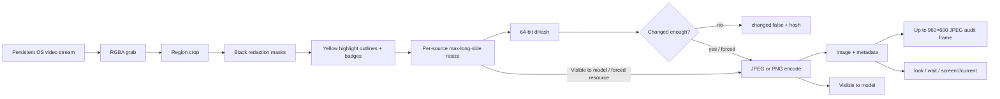

# Capture pipeline

## Decision

Every image-bearing API uses one pipeline. Crop, masks, and highlight annotations happen on raw RGBA pixels before downscale, hashing, encoding, MCP serialization, or audit-thumbnail creation. There is no alternative resource, preview, or thumbnail path that can bypass redaction or omit an annotation.

## Source and coordinate semantics

- Monitor and window frames use their native capture dimensions.
- A region stores source-space integer coordinates relative to its monitor. MCP and the model-visible preview use the same rectangle.
- Masks are stored per source key in the source dimensions reported when selection starts. If a captured
  window later resizes, the pipeline scales those canonical coordinates to the current raw frame before
  applying black pixels. The editor keeps using canonical percentages. `LivePreview` derives one inner
  canvas from the current encoded-frame aspect ratio and mounts the image plus both editor layers in that
  exact box, so their outlines and model-visible pixels stay coincident even when the outer panel is taller
  or wider than the contained frame.
- `cropFrame` and `applyMasks` clamp rectangles to frame bounds. Invalid settings masks are discarded during normalization.
- Highlights use the same stable per-source coordinate space and are scaled to the current frame when a window resizes. MCP highlight geometry is always expressed in pixels of the `width`/`height` carried by that same payload: returned-image pixels for `look` and `screen://current`, source pixels for `describe_source`.
- Masks run first. Highlight drawing writes only synthetic outline and badge pixels and never restores the source, so an overlap can point at a black block but cannot recover its redacted contents.

## Capture lifecycle

`CaptureStream.start()` asks the hidden renderer for one `getDisplayMedia` stream. Subsequent previews and MCP calls draw from the same video element; they do not reacquire it unless the active source changes. Selecting another source restarts the stream, clearing the source stops its tracks, and default-on Windows [active modal following](window-dialog-following.md) temporarily switches the same stream to an eligible owned dialog before restoring its parent. A modal omitted from Electron enumeration can supply a synthetic source object only through the internally validated HWND path; ordinary selection remains enumeration-bound.

The worker serializes start, stop, and grab requests. The controller additionally serializes selection and dialog transitions and returns each raw frame with the exact active selection used to capture it. Frame timestamps use the grab time; `frameAgeMs` measures time since the renderer's last video-frame callback, exposing frozen/minimized-window behavior.

## Encoding and change detection

The per-source policy chooses JPEG or PNG, JPEG quality, and an optional longest-side limit. Sharp resizes the already-redacted RGBA image and dHash runs on that resized data. Encoding is a separate step over the same prepared pixels.

`look(changed_since)` computes Hamming distance from the supplied 16-hex-character reported hash. At or below the configured threshold it returns no image block; when highlights exist, the text result also retains their current metadata. A normal or forced look returns image data followed by JSON metadata.

The base dHash is still computed from the prepared pixels. `capture-service` then XORs it with the first 64 bits of SHA-256 over the canonical stored highlight set. A static set preserves frame-to-frame Hamming distance, an empty set leaves the dHash untouched, and editing an annotation wakes `look(changed_since)` and `wait_for_change` even when the thin outline would disappear in dHash downsampling.

An unchanged `look(changed_since)` does not invoke an encoder. `wait_for_change` samples the persistent stream about every 500 ms, compares every sample with its immutable starting baseline, and encodes exactly once only after the threshold is exceeded. STOP wakes its delay and every asynchronous output boundary rechecks STOP before pixels leave the service.

The UI preview calls `ElectronCaptureService.preview()`. It is non-audited and does not flash client state, but it runs the same crop → masks → highlights → resize → encode path as MCP. Its displayed size and format therefore describe what the model can actually receive.

## Audit path

Only changed/forced outputs receive audit frames. `createAuditThumbnail` accepts the final encoded,
redacted frame and creates a JPEG capped at 960×600, quality 65, without enlarging smaller inputs.
`AuditLog` writes it under `~/.screenmcp/audit/thumbs/<entry-id>.jpg`, records metadata in `log.jsonl`,
and deletes files outside the configured retention ring. The Audit tab can open that retained derivative;
raw or pre-mask pixels are never passed to the filesystem layer.
