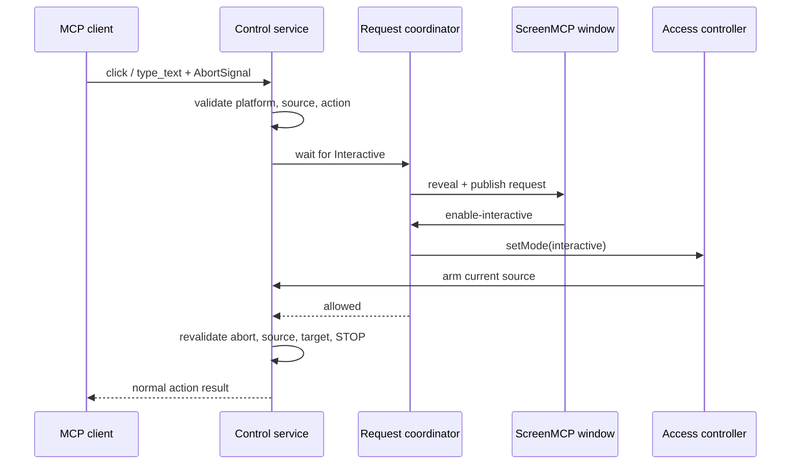

# Interactive escalation from Read-only

## Decision

ScreenMCP turns a supported MCP `click` or `type_text` received in Read-only into a visible request to
switch the current source to Interactive. The original MCP call remains pending for at most 120 seconds.
If the human accepts, the normal access-mode controller arms the current source and the same call
continues. If the human rejects or the request expires, no input occurs and the tool returns
`control_not_armed`.

This grants the existing Interactive mode; it is not one-action consent. Every connected MCP client may
control that source until the human selects Read-only/Off, presses STOP, changes the source, or quits.
The dialog states this scope. `list_elements` and `read_text` remain immediately blocked in Read-only and
never open the prompt.

## Sequence

The approval IPC refreshes active-dialog following before entering Interactive. Any parent/dialog switch
publishes a source change and cancels the old request, so approval cannot arm a replacement HWND named by
stale dialog copy.

## Cancellation and concurrency

- SDK `RequestHandlerExtra.signal` is passed through the MCP contract. An aborted waiter is removed and
  can never reach UIA or `SendInput` after later approval.
- Concurrent writes for one source share one visible mode request because approval changes global mode.
  Waiters keep independent abort signals; when the last disappears, the dialog closes.
- Source publication, Off/STOP, timeout, or shutdown settles every waiter as denied. A stale renderer
  response ID throws and cannot change mode.
- If arming fails, the request stays visible with an error and Read-only remains authoritative.

## Window and secret handling

The coordinator records whether ScreenMCP was hidden, minimized, focused, or unfocused before revealing
it. After either decision it restores that presentation before releasing the action and yields one event-loop turn. This
keeps the prompt from covering a coordinate target or remaining foreground for scoped keystrokes. Native
hit-target and foreground checks still fail closed.

Renderer request state contains only an opaque ID, self-reported client label, action kind, and source
label. `type_text` content never crosses the main/renderer boundary and audit targets retain only
`[redacted N chars]`.

## Entry points

- Coordination and lifecycle: `app-electron/src/main/interactive-request-service.ts`, `main/index.ts`
- Mode transition and response validation: `app-electron/src/main/access-mode.ts`, `main/ipc.ts`
- Write gate and final native checks: `app-electron/src/main/control-service.ts`
- MCP abort propagation: `core/mcp/src/control.ts`, `core/mcp/src/server.ts`
- Presentation: `app-electron/src/renderer/components/InteractiveRequestDialog.tsx`, `main/window.ts`
