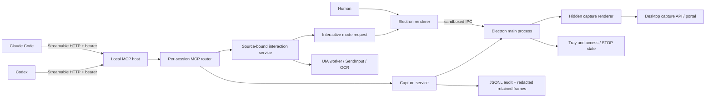

# Architecture overview

## Decision

ScreenMCP is one local Electron process containing the UI, persistent desktop-capture worker, MCP server, policy stores, tray, and audit writer. Keeping capture and serving in one process avoids a second privileged daemon and makes the visible [Off/STOP access state](access-modes.md) authoritative for every MCP path.

The MCP endpoint uses Streamable HTTP because both Claude Code and Codex support it directly. It binds to loopback and advertises its current port and bearer token through `~/.screenmcp/endpoint.json`. The default port is 47210; if occupied, the server uses an ephemeral loopback port and rewrites the endpoint file.

At startup, the app also detects local Claude Code and Codex installations and exposes the bundled
skill through a Windows junction or Unix directory symlink. Links target immutable, content-hash
payloads under `~/.screenmcp/skill-payloads`, never application resources directly. See
[agent skill installation](agent-skill-installation.md).

## Components

| Component | Entry point | Responsibility |
| --- | --- | --- |
| App lifecycle | `app-electron/src/main/index.ts` | Single-instance lock, service construction, startup, shutdown |
| HTTP boundary | `app-electron/src/main/mcp-host.ts` | Loopback listener, Host/Origin/bearer checks, endpoint file |
| MCP sessions | `app-electron/src/main/mcp-router.ts` | One SDK transport/server per initialized session and self-reported client label |
| Client presence | `app-electron/src/main/mcp-clients.ts` | Best-effort SSE/request lease for tray/UI, separate from durable MCP sessions |
| MCP contract | `core/mcp/src/server.ts` | Tools, resource, metadata, structured errors |
| Capture control | `app-electron/src/main/capture-controller.ts` | Logical source selection, serialized stream state, region metadata, [active dialog switching](window-dialog-following.md) |
| Desktop pickers | `app-electron/src/main/desktop-source-picker.ts` | Rectangle/window overlays, native window matching, cleanup |
| Capture worker | `app-electron/src/main/capture-stream.ts` and `renderer/capture/grabber.ts` | Hidden sandboxed renderer, `getDisplayMedia`, RGBA grabs |
| Security pipeline | `app-electron/src/main/capture-service.ts` | STOP/source checks, crop, masks, change gate, encoding, audit |
| Access mode | `app-electron/src/main/access-mode.ts` | Atomic Off, Read-only, and Interactive transitions over STOP and control arming |
| Interactive request | `app-electron/src/main/interactive-request-service.ts` | Paused Read-only writes, window reveal/restore, timeout, abort, and decision fan-out |
| Interactive control | `app-electron/src/main/control-service.ts` | Temporary source-bound interaction grant, UIA/OCR/input scoping, action audit |
| Native control seams | `uia-worker.ts`, `coordinate-resolver.ts`, `win-input.ts`, `ocr.ts` | COM worker, payload/physical geometry, SendInput, redacted-frame OCR |
| Human UI | `app-electron/src/renderer/App.tsx` | Three source actions, exact model preview, [shared mask/highlight rectangle editing](annotation-editors.md), [recent audited activity](recent-activity-chip.md), settings, Interactive requests, audit |
| Durable state | `settings-store.ts`, `endpoint-store.ts`, `audit-log.ts` | Atomic JSON settings/endpoint and append-only audit metadata |

## Runtime sequence

1. Electron obtains a single-instance lock, loads settings, and applies the Off or Read-only startup default before constructing serving components.
2. The localhost host starts and atomically writes `endpoint.json`.
3. A hidden sandboxed renderer initializes, but no capture begins until the human selects a source.
4. Each bearer-authenticated MCP initialize request creates a dedicated SDK transport and server. Tray/UI presence follows live response streams plus a bounded activity lease; presence expiry does not destroy protocol state.
5. View tool/resource calls enter the shared capture service. A Windows window may first switch from its retained parent to an eligible active modal. Control tools perform the same refresh, then require Interactive for that exact active HWND. A blocked Read-only click/type can ask the human to switch modes while the original request waits; Off/STOP and source selection remain authoritative.
6. UI and tray receive state events from the same `AppState`; a look flashes the capturing state for 1.5 seconds. Completed audit entries drive the renderer's ten-minute recent screenshot/interaction chip.

## Constraints and trade-offs

- Client names are self-reported UI/audit labels, not identities. The bearer token is the transport credential.
- One active stream keeps the permission and UI model understandable. Windows modal following switches that stream inside the selected application lineage; multi-source composition remains unsupported.
- Capture serialization favors predictable privacy and frame ordering over parallel throughput.
- The hidden renderer is sandboxed, so its preload is CommonJS; Electron does not support ESM sandboxed preloads.
- Wayland portal token restoration is unavailable through Electron's public API. The current stream persists only for the life of that selection.
